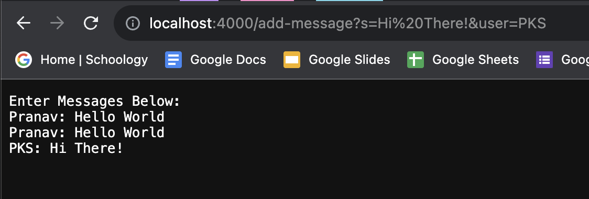
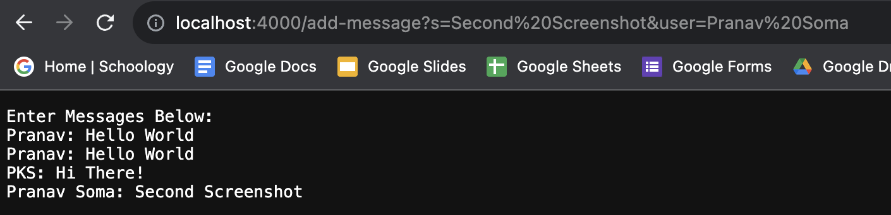
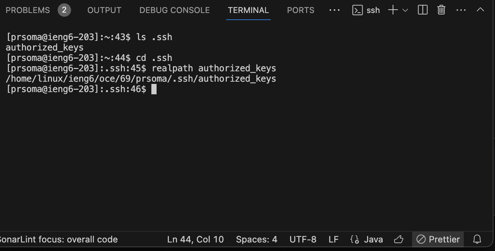
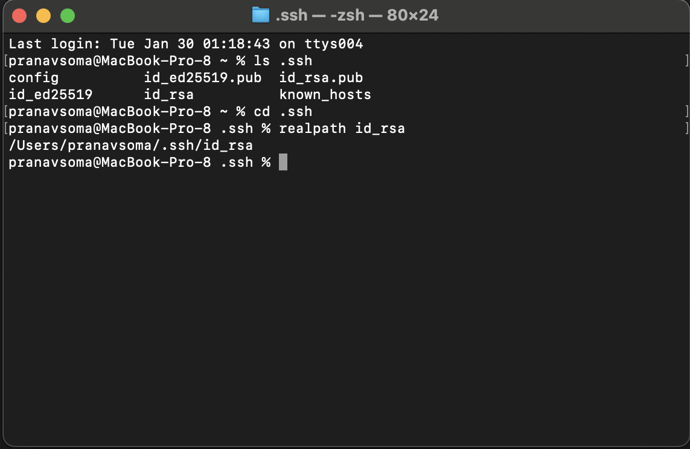
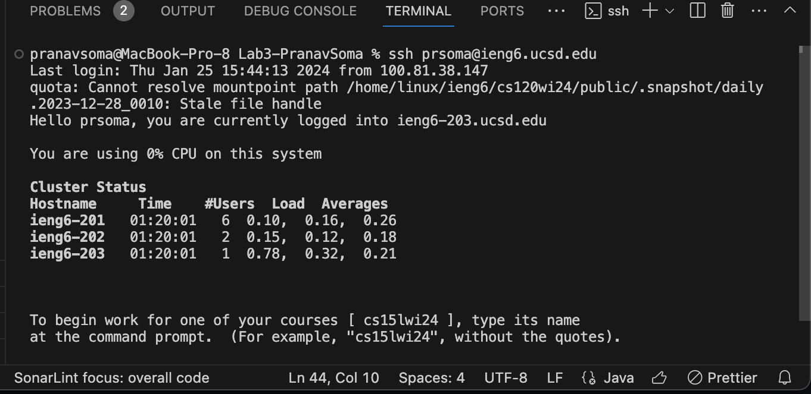

# Lab Report 2 - Servers and SSH Keys
Pranav Kumar Soma
---
# Part 1
## Code:
```
ChatServer.java

import java.io.IOException;
import java.net.URI;

class Handler implements URLHandler {
    String chatHistory = "Enter Messages Below:\n";

    public String handleRequest(URI url) {

        if(url.getPath().contains("add-message")){
            String[] parameters = url.getQuery().split("&");

            String[] s = parameters[0].split("=");
            String[] user = parameters[1].split("=");

            chatHistory += user[1] + ": " + s[1] + "\n";

            return chatHistory;
        }

        return "404 Not Found!";
    }
}

public class ChatServer {
    public static void main(String[] args) throws IOException {
        if(args.length == 0){
            System.out.println("Missing port number! Try any number between 1024 to 49151");
            return;
        }

        int port = Integer.parseInt(args[0]);

        Server.start(port, new Handler());
    }
}
```
## Usage 1 of /add-server


Explanation:

Whenever the add-server page is reloaded with the proper parameters, the handleRequest method in the Handler class is executed with the updated URI,
which in this case is the "url" argument of type "URI," containing information like the current host, path, queries, and other relevant information
about the URL.

The ChatServer class started the port from the command line argument when the program was first run, and the Handler class contains the field called
chatHistory, which starts with "Enter Messages Below:\n" every time the server starts. I used /add-server twice before this screenshot, so the field
chatHistory contained the raw string "Enter Messages Below:\nPranav: HelloWorld\nPranav: HelloWorld\n". However, once the /add-server was entered
with the queries in the screenshot, which was retrieved using the url.getQuery() function, containing "s=Hi There!&user=PKS", it was just a matter
of using split functions and adding the relevant formatting to update the chatHistory field to look like: "Enter Messages Below:\nPranav: HelloWorld\nPranav: HelloWorld\n
PKS: Hi There!\n". The updated chatHistory field then gets returned and printed out to the website.

## Usage 2 of /add-server
 
---
# Part 2
For this part, I decided to ls for my .ssh directory and then to cd into it. From there, I would use the realpath command to generate the absolute path \
for the files for which I needed the absolute paths. Initially, I was unsure as to what the authorized_keys file was doing in my server when I expected id_rsa.pub, 
but a quick google search showed me that the authorized_keys file contained the public key, which was what I wanted. 

## Absolute Path for Private Key in Local
 
## Absolute Path for Public Key in Server

## Proof of Logging into Server without the use of a Password


---
# Part 3

I think I learned a lot in Week 2 of CSE 15L, when we began the handling of servers and URIs. I've previously only been familiar with the part 
of computer science and software development that involved algorithms and basic full-stack development. I really appreciate gaining knowledge
about things like starting a server and running code on remote environment with commands like ssh, scp, and more that depict a different perspective
of CS. I really like how there's a lot of things that make our lives a bit easier when coding, like using "~" when you don't know a specific path to
a directory or file, and even things like the "man" command that show us how to use and learn about more commands.
