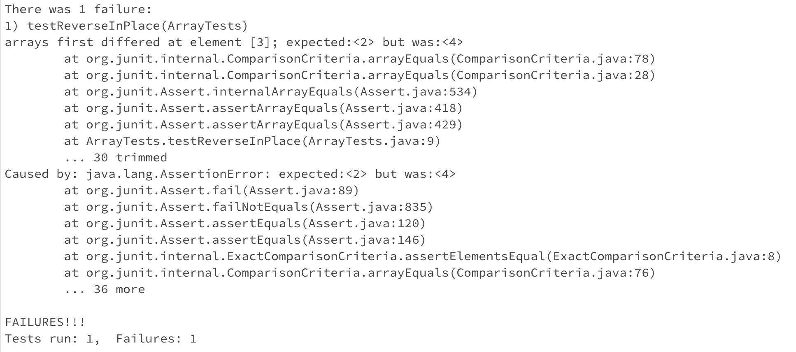

# Lab Report 3 - Bugs and Commands (Week 5)
Pranav Kumar Soma

---

## Part 1 - Bugs

## Method Chosen: testReverseInPlace()

Note: I created a bash script to compile and run test classes for me, which I use to run the test cases in the terminal with ease.
Here is the code for it:
```
# tests.sh
set -e
javac -cp .:lib/hamcrest-core-1.3.jar:lib/junit-4.13.2.jar *.java
java -cp .:lib/hamcrest-core-1.3.jar:lib/junit-4.13.2.jar org.junit.runner.JUnitCore $1
```

### Failure Inducing Input:
Test Code:
```
import static org.junit.Assert.*;
import org.junit.*;

public class ArrayTests {
	@Test 
	public void testReverseInPlace() {
		int[] input1 = {1, 2, 3, 4, 5 };
		ArrayExamples.reverseInPlace(input1);
		assertArrayEquals(new int[]{5, 4, 3, 2, 1}, input1);
	}
}
```
### Input That Doesn't Induce a Failure:
Test Code:
```
import static org.junit.Assert.*;
import org.junit.*;

public class ArrayTests {
	@Test
	public void testReverseInPlace() {
		int[] input1 = { 3 };
		ArrayExamples.reverseInPlace(input1);
		assertArrayEquals(new int[]{ 3 }, input1);
	}
}
```
### Symptom:
Symptom for the first test:



Symptom for the second test:


### The Bug:

Code Before:
```
static void reverseInPlace(int[] arr) {
	for(int i = 0; i < arr.length; i += 1) {
		arr[i] = arr[arr.length - i - 1];
	}
}
```
Code After:
```
static void reverseInPlace(int[] arr) {
	for(int i = 0; i < arr.length/2; i++) {
		int temp = arr[arr.length - i - 1];
		arr[arr.length-i-1] = arr[i];
		arr[i] = temp;
	}
}
```
Brief Description of the Bug and Fix:

Essentially, the initial code sets the values of the elements in the first half of the array without storing those values somewhere, 
which meant that when values were being assigned to the second half, the values in the first half of the array were all of the values
that had already been reversed. 

My fix performs a swap operation, swapping the first and last element, then the second and second-to-last element, and so on, until
the loop reaches the middle of the array. If the number of elements in the array is even, the two middle elements get swapped, and if
the number of elements is odd, the middle element stays where it is. The usage of a ```temp``` variable makes sure that none of the values
of the input array are lost.

---

## Part 2 - Researching Commands

Command Selected: ```find```

### Usage 1:

Example 1:

Example 2:

### Usage 2:

Example 1:

Example 2:

### Usage 3:

Example 1:

Example 2:

### Usage 4: 

Example 1:

Example 2:

---

## Sources Cited:

