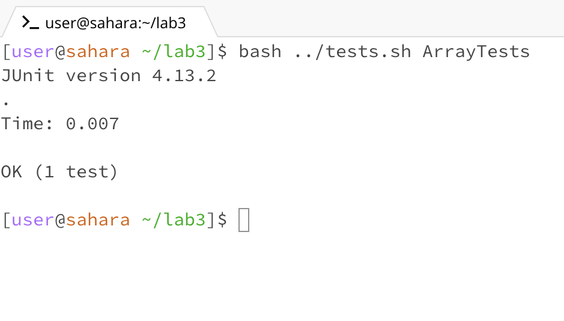

# Lab Report 3 - Bugs and Commands (Week 5)
Pranav Kumar Soma

---

## Part 1 - Bugs

## Method Chosen: testReverseInPlace()

Note: I created a bash script to compile and run test classes for me, which I use to run the test cases in the terminal with ease.
Here is the code for it:
```
# tests.sh
set -e
javac -cp .:lib/hamcrest-core-1.3.jar:lib/junit-4.13.2.jar *.java
java -cp .:lib/hamcrest-core-1.3.jar:lib/junit-4.13.2.jar org.junit.runner.JUnitCore $1
```

### Failure Inducing Input:
Test Code:
```
import static org.junit.Assert.*;
import org.junit.*;

public class ArrayTests {
	@Test 
	public void testReverseInPlace() {
		int[] input1 = {1, 2, 3, 4, 5 };
		ArrayExamples.reverseInPlace(input1);
		assertArrayEquals(new int[]{5, 4, 3, 2, 1}, input1);
	}
}
```
### Input That Doesn't Induce a Failure:
Test Code:
```
import static org.junit.Assert.*;
import org.junit.*;

public class ArrayTests {
	@Test
	public void testReverseInPlace() {
		int[] input1 = { 3 };
		ArrayExamples.reverseInPlace(input1);
		assertArrayEquals(new int[]{ 3 }, input1);
	}
}
```
### Symptom:
Symptom for the first test:


Symptom for the second test:



### The Bug:

Code Before:
```
static void reverseInPlace(int[] arr) {
	for(int i = 0; i < arr.length; i += 1) {
		arr[i] = arr[arr.length - i - 1];
	}
}
```
Code After:
```
static void reverseInPlace(int[] arr) {
	for(int i = 0; i < arr.length/2; i++) {
		int temp = arr[arr.length - i - 1];
		arr[arr.length-i-1] = arr[i];
		arr[i] = temp;
	}
}
```
Brief Description of the Bug and Fix:

Essentially, the initial code sets the values of the elements in the first half of the array without storing those values somewhere, 
which meant that when values were being assigned to the second half, the values in the first half of the array were all of the values
that had already been reversed. 

My fix performs a swap operation, swapping the first and last element, then the second and second-to-last element, and so on, until
the loop reaches the middle of the array. If the number of elements in the array is even, the two middle elements get swapped, and if
the number of elements is odd, the middle element stays where it is. The usage of a ```temp``` variable makes sure that none of the values
of the input array are lost.

---

## Part 2 - Researching Commands

Command Selected: ```grep```

### Usage 1: grep -i <pattern> <files>

Example 1:
```
pranavsoma@MacBook-Pro-9 technical % grep -i "directors" ./government/About_LSC/Strategic_report.txt
proud to provide to the LSC Board of Directors this third progress
placed before us in January 2000 by the LSC Board of Directors. In
January 2000, the LSC Board of Directors adopted a strategic
Board of Directors describing our efforts to help build premier
believe this format will provide the LSC Board of Directors a
We thank the LSC Board of Directors for giving us this
Board of Directors for giving us the opportunity to improve a legal
Southeast Project Directors Association. LSC organized a
directors of statewide programs, we designed a pilot mentoring
project for new statewide program executive directors. In its
directors with an experienced one. The three convened at each
executive directors of LSC-funded programs. We discovered that
directors remained virtually unchanged, and the number of women
directors was significantly lower than their percentage in the
data. These indicated that the number of directors of color rose
directors continues to lag behind their increasing presence in our
o Southeast Project Directors Association Conference (New
communities for executive directors of state and territory-wide
recipient programs. Our goal was to focus executive directors on
```

In this usage of ```grep -i```, I checked to see which lines in ```technical/government/About_LSC/strategic_report.txt``` uses the word "director". 
The addition of "-i" allows me to be case-insensitive in my search, which is helpful if several people edited a document with inconsistent capitalization,
and more than that, it allows me to see all of the occurrences of "director", no matter what kind of capitalization it has. As you can see, there are occurrences
where both "Director" and "director" are used, and using grep normally would make one miss a considerable number of mentions of this word.

Example 2:

```
pranavsoma@MacBook-Pro-9 technical % grep -i "flight" ./911report/chapter-11.txt
		experts. In 1996, as a result of the TWA Flight 800 crash, President Clinton created
                the coast of Massachusetts of EgyptAir Flight 990, a Boeing 767. The most plausible
                pursuing flight training to fly large jet aircraft, or seeking to buy advanced
                flight simulators.
                Minnesota flight school. In late August, the Moussaoui arrest was briefed to the DCI
                would have needed to secure basing and overflight support from neighboring
                Bureau's arrest of an Islamic extremist taking flight training until September 11.
                identify one of the travelers as Khalid al Mihdhar. After the flight left, they
                on January 15 on a United Airlines flight to Los Angeles. Since the CIA did not
```

In this usage of ```grep -i```, I checked to see which lines in ```technical/911report/chapter-11.txt``` uses the word "flight" or the word with any other variations
in capitalization. From this usage of ```-i```, it's shown that the command was able to bring both lines with "flight" and "Flight" in them, allowing the user of this
command to get a broader and more reliable search for these occurrences. 

### Usage 2: grep -r <pattern> <files>

Example 1:
```
pranavsoma@MacBook-Pro-9 technical % grep -r "Bin Laden" ./911report                     
./911report/chapter-13.4.txt:                Terrorism, Sudan Struck a Blow by Fleecing Bin Laden," Wall Street Journal, Dec. 3,
./911report/chapter-13.4.txt:                Bin Laden: How Bill Clinton's Failures Unleashed Global Terror (Regnery, 2003),
./911report/chapter-13.4.txt:                memo,"U.S. Engagement with the Taliban on Usama Bin Laden," undated (attached to NSC
./911report/chapter-13.5.txt:            8. Tim Weiner, "U.S. Hard Put to Find Proof Bin Laden Directed Attacks," New York
./911report/chapter-13.5.txt:                final aim is the restoration of the caliphate.'"Mehdi Mozaffari,"Bin Laden and
./911report/chapter-13.3.txt:                www.npr.org/display_pages/features/feature_1253796.html). 14. "Bin Laden's 'Letter
./911report/chapter-13.3.txt:                Fleecing Bin Laden," Wall Street Journal, Dec. 3, 2001, p. A1.
./911report/chapter-13.3.txt:            87. For general information on Hage, see Oriana Gill, "Hunting Bin Laden: A Portrait
./911report/chapter-13.3.txt:            93. ABC News interview, "Terror Suspect: An Interview with Osama Bin Laden," Dec. 22,
./911report/chapter-13.3.txt:                Statements of Prosecutor and Judge, United States v. Bin Laden, No. S(7) 98 Cr. 1023
./911report/chapter-13.3.txt:                FBI Special Agent Daniel Coleman, United States v. Usama Bin Laden, No. S(7) 98 Cr.
./911report/chapter-13.3.txt:            109. Indictment, United States v. Usama Bin Laden, No. 98 Cr. (S.D. N.Y. unsealed
./911report/chapter-6.txt:                to resolve the Bin Laden problem at the earliest possible time." But Zinni came back
./911report/chapter-11.txt:                terrorist leader, with the headline "U.S. Hard Put to Find Proof Bin Laden Directed
```
In this usage of ```grep -r```, I looked within the ```technical/911report``` directory for any mentions of Bin Laden. The usage of ```-r``` in this case was useful
because I did not have to list out every single file in the directory to see if they had mentions of the name and the command 
conveniently states which files contain the name and prints the line in which it is mentioned.

Example 2:
```
pranavsoma@MacBook-Pro-9 technical % grep -r "citizens" ./government
./government/About_LSC/Special_report_to_congress.txt:of low-income citizens solve important, sometimes life-threatening,
./government/About_LSC/Special_report_to_congress.txt:cases for lack of citizenship or alien status documentation. It
./government/About_LSC/Special_report_to_congress.txt:required documentation (financial eligibility, citizenship/eligible
./government/About_LSC/Special_report_to_congress.txt:(financial eligibility, citizenship/eligible alien status,
./government/About_LSC/commission_report.txt:citizens. (The report refers to these classes as "unrestricted
./government/About_LSC/commission_report.txt:same subjects as is provided to citizens. (These classes will be
./government/About_LSC/commission_report.txt:Like U.S. citizens, aliens seek legal assistance on a variety of
./government/About_LSC/commission_report.txt:parents, and unmarried citizens [sic] [children] of permanent
./government/About_LSC/commission_report.txt:eligible for derivative U.S. citizenship under § 212(d)(5) of the
./government/About_LSC/commission_report.txt:and refugee law, citizenship law, constitutional law, and public
./government/About_LSC/ONTARIO_LEGAL_AID_SERIES.txt:low-income citizens solve important, sometimes life-threatening,
./government/About_LSC/diversity_priorities.txt:The client community has changed. Women, senior citizens
./government/About_LSC/reporting_system.txt:citizens. It equips people to handle simple matters themselves,
./government/About_LSC/State_Planning_Report.txt:serves senior citizens; the Equal Justice Foundation, which
./government/About_LSC/State_Planning_Special_Report.txt:Corporation. LSC has helped millions of low-income citizens solve
./government/Env_Prot_Agen/final.txt:control equipment. It also assures citizens who live near new major
./government/Env_Prot_Agen/tech_adden.txt:of mortality risk reductions expressed by citizens in the United
./government/Gen_Account_Office/d0269g.txt:available to all Australian citizens. From 1999 through 2000, HIC
./government/Gen_Account_Office/Testimony_cg00010t.txt:Support the Transition to a American citizens are increasingly
./government/Gen_Account_Office/Testimony_cg00010t.txt:it performs its services to the country and its citizens.
./government/Gen_Account_Office/Testimony_cg00010t.txt:services and information to citizens, in such areas as tax
./government/Gen_Account_Office/Testimony_cg00010t.txt:In the United States, American citizens are increasingly
./government/Gen_Account_Office/GovernmentAuditingStandards_yb2002ed.txt:citizens. In addition to an interest in the program, potential
./government/Gen_Account_Office/GovernmentAuditingStandards_yb2002ed.txt:purposes of helping unemployable citizens get and keep jobs and
./government/Gen_Account_Office/d01376g.txt:implementations of IT that benefit citizens, leadership in managing
./government/Gen_Account_Office/Statements_Feb28-1997_volume.txt:make a profit but to serve the needs of the citizens and to promote
./government/Gen_Account_Office/pe1019.txt:set of standard income tax questions about which citizens typically
./government/Gen_Account_Office/pe1019.txt:made, with GAO personnel taking the role of ordinary citizens in
./government/Gen_Account_Office/gg96118.txt:or to address differing conditions and citizens' needs that have
./government/Gen_Account_Office/gg96118.txt:of greatest concern to citizens or posed the greatest risk to the
./government/Gen_Account_Office/gg96118.txt:as well, on the needs and expectations of the nation's citizens. In
./government/Gen_Account_Office/og96038.txt:businesses within the State and protect the health of its citizens;
./government/Gen_Account_Office/Sept14-2002_d011070.txt:positions that interact with citizens.2 Effective workforce
./government/Gen_Account_Office/Sept14-2002_d011070.txt:accountability. To optimize the provision of services to citizens,
./government/Gen_Account_Office/Sept14-2002_d011070.txt:to $100,000 in financial assistance to citizens adversely affected
./government/Gen_Account_Office/Sept14-2002_d011070.txt:closer to citizens and provide services and information as part of
./government/Gen_Account_Office/Sept14-2002_d011070.txt:and how they are contributing to the results that American citizens
./government/Gen_Account_Office/June30-2000_gg00135r.txt:all state agencies to selectively notify citizens of opportunities
./government/Gen_Account_Office/June30-2000_gg00135r.txt:hearings, through which geographically dispersed citizens can
./government/Gen_Account_Office/d01591sp.txt:capital. In contrast, citizens, companies, and governments in an
./government/Gen_Account_Office/og97041.txt:citizens, 5 from other federal agencies, 60 from state agencies,
./government/Gen_Account_Office/og96026.txt:labor unions, and 31 private citizens. This rule reflects EPA's
./government/Gen_Account_Office/Testimony_Jul17-2002_d02957t.txt:the nation's ability to protect its borders and citizens against
./government/Post_Rate_Comm/Cohenetal_comparison.txt:citizens throughout the nation. Without the monopoly, they argue,
./government/Media/highlight_Senior_Day.txt:We also can agree that older Oklahomans - like all citizens -
./government/Media/Supporting_Legal_Center.txt:efforts for equal access to justice for all of Utah's citizens. The
./government/Media/Supporting_Legal_Center.txt:foundations, businesses and private citizens to contribute the
./government/Media/Barnes_new_job.txt:18,000 homeowners -- many of them senior citizens -- with its
./government/Media/Annual_Fee.txt:their ability, thereby assisting the citizens of Illinois," Sheila
./government/Media/Eviction_law.txt:The case was brought by four Oakland, Calif., senior citizens,
./government/Media/Volunteers_Step_Up.txt:the safety of our citizens. Even within the new and frightening
./government/Media/Volunteers_Step_Up.txt:senior citizens from unscrupulous business persons and by giving
./government/Media/IOLTA_INTEREST_RATE.txt:the most vulnerable citizens of the state, can only represent, at
./government/Media/Self-Help_Website.txt:"There are now just over 1 million poor citizens in Ohio who
./government/Media/Firm_to_the_Poor_Needs_Help.txt:citizens.
./government/Media/Civil_Matters.txt:When indigent citizens get in criminal trouble, public defenders
./government/Media/man_on_national_team.txt:work on behalf of poor citizens who are requesting legal
./government/Media/BusinessWire.txt:state and federal courts. LAD services more than 15,000 citizens
./government/Media/Attorney_gives_his_time.txt:senior citizens with their legal needs, free of charge.
./government/Media/GreensburgDailyNews.txt:citizens not just the rich."
./government/Media/Understanding.txt:a senior citizens facility.
./government/Media/Politician_Practices.txt:American. Some shine best as citizens.
./government/Media/Politician_Practices.txt:So now Barnes, too, will "retire" into citizenship. The
```

In this usage of ```grep -r```, the command looked through the ```technical/government``` directory and all of its subdirectories for files that contained
the usage of the word, "citizens". The regular ```grep``` command only looks through the files mentioned, and using ```-r``` saved a lot of time with finding
all of the occurrences of the word "citizens".

### Usage 3: grep -L <pattern> <files>

Example 1:
```
pranavsoma@MacBook-Pro-9 technical % grep -r -L "Bin Laden" ./911report
./911report/chapter-13.1.txt
./911report/chapter-13.2.txt
./911report/chapter-3.txt
./911report/chapter-2.txt
./911report/chapter-1.txt
./911report/chapter-5.txt
./911report/chapter-7.txt
./911report/chapter-9.txt
./911report/chapter-8.txt
./911report/preface.txt
./911report/chapter-12.txt
./911report/chapter-10.txt
```

I used ```grep -r -L``` together to look through the entire ```technical/911report``` directory to find the files that don't mention the string "Bin Laden."
This may be helpful if one wanted to look for files without a culturally charged context, as files mentioning "Bin Laden" probably also include triggering
messages of violence and death. 

Example 2:

```
pranavsoma@MacBook-Pro-9 technical % grep -r -i -L "gene" ./biomed
./biomed/1471-2466-1-1.txt
./biomed/cc991.txt
./biomed/1471-2407-2-3.txt
./biomed/1471-2202-4-12.txt
./biomed/cc367.txt
./biomed/1471-2202-4-17.txt
./biomed/bcr618.txt
./biomed/1471-2377-2-6.txt
./biomed/cc1843.txt
./biomed/1471-230X-1-6.txt
./biomed/1471-2431-3-5.txt
./biomed/cc1477.txt
./biomed/cc1852.txt
./biomed/cc1476.txt
./biomed/1471-2210-2-6.txt
./biomed/cc2358.txt
./biomed/cc2167.txt
./biomed/1471-2334-2-27.txt
./biomed/1471-5945-2-13.txt
./biomed/1471-2407-2-22.txt
./biomed/1471-2172-2-9.txt
./biomed/ar149.txt
./biomed/1471-2431-2-11.txt
./biomed/1468-6708-3-1.txt
./biomed/1471-2458-1-9.txt
./biomed/1471-2407-1-13.txt
./biomed/cvm-2-4-187.txt
```
I used ```grep -r -i -L``` to look through the entire ```technical/biomed``` directory, to be case sensitive when looking for occurrences of the word, "gene", and
to print out the files that don't contain any capitalization variation of "gene". This would be helpful if you're curating the directory of biomed files, and knowing that
the word "gene" isn't mentioned may mean that those files need to be deleted or archived. 

### Usage 4: grep -m <pattern> <files>

Example 1:
```
pranavsoma@MacBook-Pro-9 technical % grep -r "citizens" ./government -m 1
./government/About_LSC/Special_report_to_congress.txt:of low-income citizens solve important, sometimes life-threatening,
./government/About_LSC/commission_report.txt:citizens. (The report refers to these classes as "unrestricted
./government/About_LSC/ONTARIO_LEGAL_AID_SERIES.txt:low-income citizens solve important, sometimes life-threatening,
./government/About_LSC/diversity_priorities.txt:The client community has changed. Women, senior citizens
./government/About_LSC/reporting_system.txt:citizens. It equips people to handle simple matters themselves,
./government/About_LSC/State_Planning_Report.txt:serves senior citizens; the Equal Justice Foundation, which
./government/About_LSC/State_Planning_Special_Report.txt:Corporation. LSC has helped millions of low-income citizens solve
./government/Env_Prot_Agen/final.txt:control equipment. It also assures citizens who live near new major
./government/Env_Prot_Agen/tech_adden.txt:of mortality risk reductions expressed by citizens in the United
./government/Gen_Account_Office/d0269g.txt:available to all Australian citizens. From 1999 through 2000, HIC
./government/Gen_Account_Office/Testimony_cg00010t.txt:Support the Transition to a American citizens are increasingly
./government/Gen_Account_Office/GovernmentAuditingStandards_yb2002ed.txt:citizens. In addition to an interest in the program, potential
./government/Gen_Account_Office/d01376g.txt:implementations of IT that benefit citizens, leadership in managing
./government/Gen_Account_Office/Statements_Feb28-1997_volume.txt:make a profit but to serve the needs of the citizens and to promote
./government/Gen_Account_Office/pe1019.txt:set of standard income tax questions about which citizens typically
./government/Gen_Account_Office/gg96118.txt:or to address differing conditions and citizens' needs that have
./government/Gen_Account_Office/og96038.txt:businesses within the State and protect the health of its citizens;
./government/Gen_Account_Office/Sept14-2002_d011070.txt:positions that interact with citizens.2 Effective workforce
./government/Gen_Account_Office/June30-2000_gg00135r.txt:all state agencies to selectively notify citizens of opportunities
./government/Gen_Account_Office/d01591sp.txt:capital. In contrast, citizens, companies, and governments in an
./government/Gen_Account_Office/og97041.txt:citizens, 5 from other federal agencies, 60 from state agencies,
./government/Gen_Account_Office/og96026.txt:labor unions, and 31 private citizens. This rule reflects EPA's
./government/Gen_Account_Office/Testimony_Jul17-2002_d02957t.txt:the nation's ability to protect its borders and citizens against
./government/Post_Rate_Comm/Cohenetal_comparison.txt:citizens throughout the nation. Without the monopoly, they argue,
./government/Media/highlight_Senior_Day.txt:We also can agree that older Oklahomans - like all citizens -
./government/Media/Supporting_Legal_Center.txt:efforts for equal access to justice for all of Utah's citizens. The
./government/Media/Barnes_new_job.txt:18,000 homeowners -- many of them senior citizens -- with its
./government/Media/Annual_Fee.txt:their ability, thereby assisting the citizens of Illinois," Sheila
./government/Media/Eviction_law.txt:The case was brought by four Oakland, Calif., senior citizens,
./government/Media/Volunteers_Step_Up.txt:the safety of our citizens. Even within the new and frightening
./government/Media/IOLTA_INTEREST_RATE.txt:the most vulnerable citizens of the state, can only represent, at
./government/Media/Self-Help_Website.txt:"There are now just over 1 million poor citizens in Ohio who
./government/Media/Firm_to_the_Poor_Needs_Help.txt:citizens.
./government/Media/Civil_Matters.txt:When indigent citizens get in criminal trouble, public defenders
./government/Media/man_on_national_team.txt:work on behalf of poor citizens who are requesting legal
./government/Media/BusinessWire.txt:state and federal courts. LAD services more than 15,000 citizens
./government/Media/Attorney_gives_his_time.txt:senior citizens with their legal needs, free of charge.
./government/Media/GreensburgDailyNews.txt:citizens not just the rich."
./government/Media/Understanding.txt:a senior citizens facility.
./government/Media/Politician_Practices.txt:American. Some shine best as citizens.
```
I added ```-m 1``` to one of the commands used previously in this document, ```grep -r "citizens" ./government``` to limit the number of occurrences of "citizens" in the ```technical/government``` directory printed per file to 1. This makes it helpful if you're looking for the first occurrence of "citizen" per file or if you just don't want to be clogged with too much text on your terminal.

Example 2:

```
pranavsoma@MacBook-Pro-9 technical % grep  -m 3 "base pair" ./biomed/1471-2164-3-7.txt 
          the detection window of 45 to 900 base pairs and
          increasing numbers of base pairs: NewHeight =
          correspond to sequence length in base pairs better than
```
I added ```-m 3``` to ```grep "base pair" ./biomed/1471-2164-3-7.txt``` to get the first three occurrences of the phrase "base pair" in the file 
```technical/biomed/1471-2164-3-7.txt```. This would be useful if analyzing research papers, because research papers usually start with the abstract, and seeing the lines in which a certain keyword is mentioned allows us to see how useful said paper is to our purposes. 

Side Note: I think it's very fascinating how all of these commands can be used together
to perform more complex actions and curate the output to our needs.

---

## Sources Cited:

*grep(1) - Linux manual page.* (2023). Man7.org. https://man7.org/linux/man-pages/man1/grep.1.html
‌

