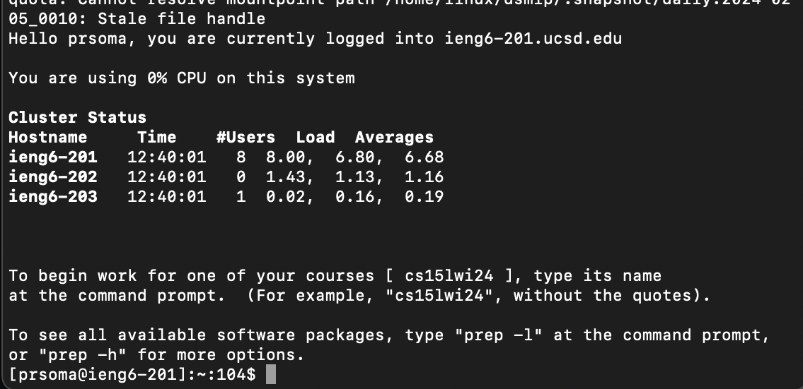
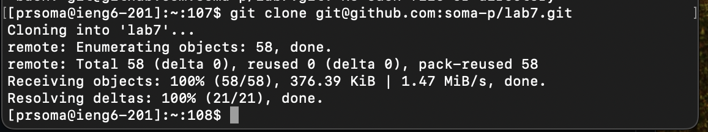
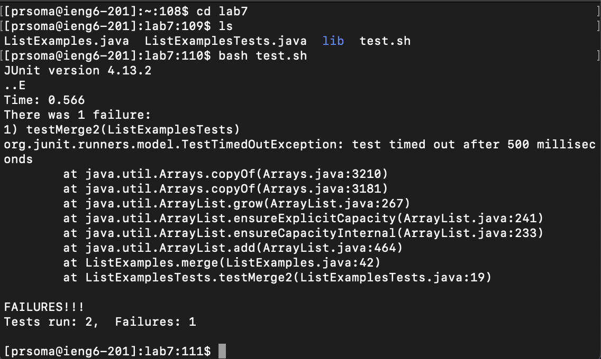
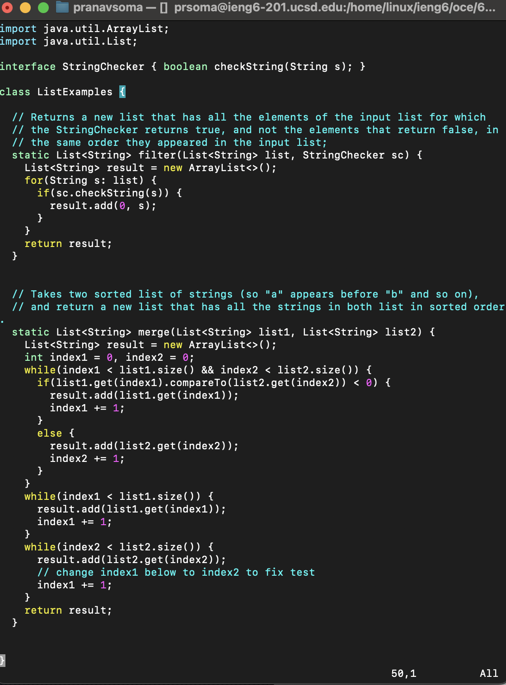
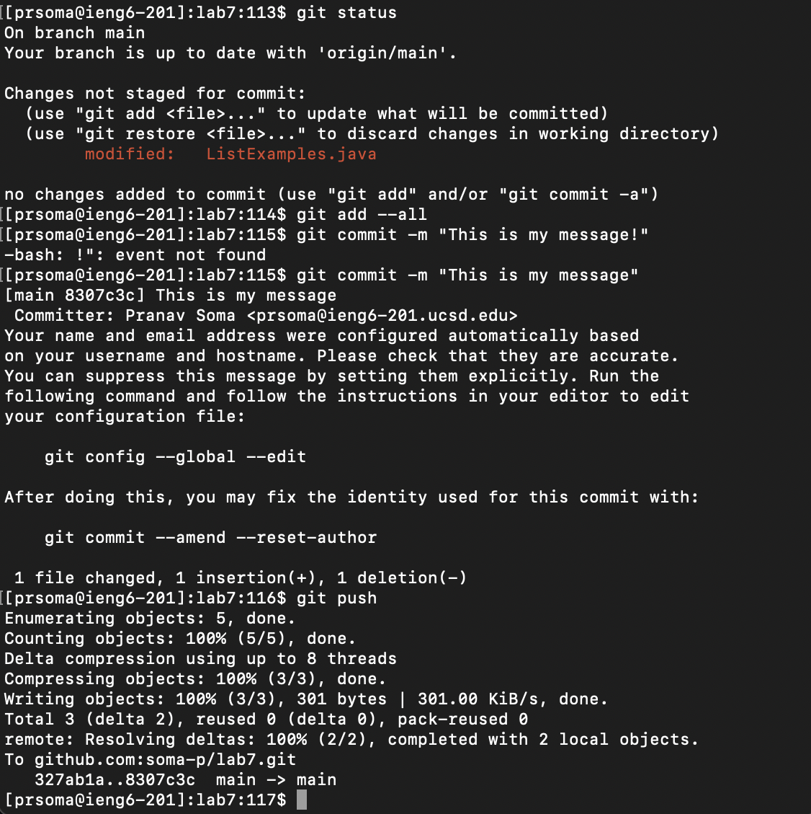
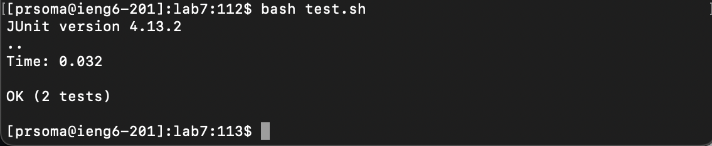

# Lab Report 4 - Vim (Week 7)

---

## Pranav Kumar Soma

---

## Reproducing Steps 4 - 9

### Step 4 - Logging into ieng6

I used the basic ```ssh``` command to establish a remote connection with an ieng6 computer.

 

*Insert image here*

### Step 5 - Cloning my fork of the repository from my Github account (using the SSH URL)

I used the ```git clone``` command combined with SSH URL I obtained from the fork I made on github to clone the repository to my local device.

```git clone git@github.com:soma-p/lab7.git```



### Step 6 - Running the tests, demonstrating that they fail

Before I ran the tests, I made sure to ```cd``` into the ```lab7``` directory, and to ```ls``` it to familiarize myself with the names of the files.

```
cd lab 7
ls
```

Then, I ran the bash script ```test.sh``` to compile and run the tester file.

```bash test.sh```



### Step 7 - Editing the code file to fix the failing test

To edit the code file, I used the ```vim``` command to enter the IDE, opening the file with the cursor at the bottom.

```vim ListExamples.java```



From there, I entered the following commands successively: ```6k``` ```e``` ```r2``` ```:wq<enter>```

The command ```6k``` moved the cursor 6 lines up from the initial position, which took me to the desired line I wanted to make edits in.
The command ```e``` moved the cursor to the end of the next word, which contained the variable name I wished to change.
The command ```r2``` replaced the character the cursor is currently on (the end of the variable ```index1```) and replaced it with ```2```. 
Thus, ```index1``` was changed to ```index2```
Lastly, the  command ```:wq<enter>``` saved the file and exited the vim IDE.

### Step 8 - Running the tests, demonstrating that they now succeed

I ran the bash script ```test.sh``` to compile and run the tester file, displaying that all tests now pass.

```bash test.sh```



### Step 9 - Committing and pushing the resulting change to your Github account (you can pick any commit message!)

I chose to first use ```git status``` to check my status of the repository, and then used the ```add --all``` command to add all of my changes
to my local repository. I then used the ```git commit -m "This is my message!"``` to commit these changes to my local repositorry
without having to enter the vim IDE for the commit message. However, the command line didn't accept "!" as a valid character, so I had to change my message slightly
to ```git commit -m "This is my message"```. Lastly, I used ```git push``` to push my committed code to the remote repository.



